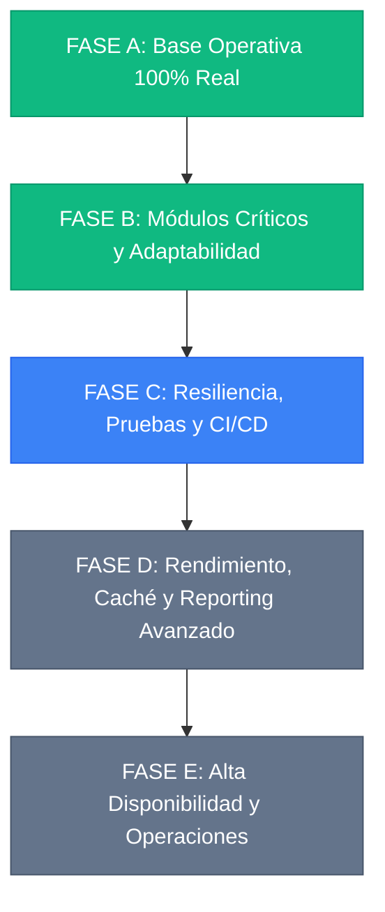

# 🗺️ ROADMAP — FerreColors ERP
*Actualizado: 13 de agosto, 2026*

## 📌 Resumen Ejecutivo del Sistema

ERP de nivel industrial desarrollado con **Next.js 14 (App Router) + TypeScript + Prisma ORM / PostgreSQL**, con integración bidireccional a **CONTPAQi Comercial Premium**, timbrado fiscal **CFDI SAT 4.0** y motor de punto de venta y cobranza móvil offline PWA.

| Métrica | Valor Auditado Real |
|---------|---------------------|
| **Páginas Operativas** | **43 Páginas** (Ventas, POS, Compras, Crédito, BI, Pagarés, etc.) |
| **Rutas API REST** | **116 Endpoints** (100% integrados a PostgreSQL sin mocks) |
| **Componentes de UI y Dominio** | **79 Componentes** (Radix UI / Shadcn + Paneles de Negocio) |
| **Librerías Core (`lib/`)** | **24 Módulos** (CONTPAQi, PDFKit, EscPos, Scheduler, etc.) |
| **Modelos de Base de Datos** | **30 Modelos Prisma** con migraciones e índices trigram |
| **Typecheck (`tsc --noEmit`)** | ✅ **0 Errores (Pasa limpio)** |
| **Integración de Datos** | ✅ **100% Real (Sin Mocks ni datos ficticios)** |
| **Modos de Experiencia** | **3 Modos Activos** (💻 Desktop, 📱 PWA, 🏃 Móvil de Campo) |

---

## ✅ HITOS COMPLETADOS (SPRINTS 1 AL 5)

### 🛡️ Sprint 1 — Seguridad y Hardening *(Junio 2026)*
- [x] Eliminación de credenciales sensibles en documentación y repositorio.
- [x] Webhook CONTPAQi blindado con verificación criptográfica `HMAC-SHA256` y `timingSafeEqual`.
- [x] Endpoint `/api/clientes/import` protegido con `getServerSession` y roles ADMIN/SUPERADMIN.
- [x] Rate limiting in-memory para endpoints críticos (`signup`, `sms/send`, `sms/bulk`, `whatsapp/send`).
- [x] Sanitización de respuestas de error API evitando filtración de stacks o cadenas internas a clientes.

### 💼 Sprint 2 — Módulos de Alto Valor Transaccional *(Junio 2026)*
- [x] **Compras**: Gestión de proveedores, órdenes con desglose dinámico, recepciones y Cuentas por Pagar automáticas.
- [x] **Facturación Electrónica**: Generador de CFDI SAT 4.0, integración PAC, descarga/visualización de XML y PDF.
- [x] **Automatización**: Planificador de tareas en segundo plano (`lib/scheduler.ts`), endpoint `/api/cron/run` y auditoría de ejecución.

### 🧭 Sprint 2.5 — Homogeneización de Navegación y Rutas *(Junio 2026)*
- [x] Estandarización de componentes `Header` y navegación unificada en los 35+ módulos.
- [x] Enrutamiento de pedidos (`/pedidos/[id]`, `/pedidos/[id]/editar`, `/pedidos/nuevo`) y API REST completa.
- [x] Documentación técnica y propuesta comercial de alto impacto para FerreColors.

### 🏷️ Sprint 3 — POS, Folios Industriales y Motor PDF *(Julio - Agosto 2026)*
- [x] **POS con Búsqueda Reactiva**: Input debounce (350ms) con búsqueda por Nombre, Código de Barras y RFC.
- [x] **Generador de Folios Secuenciales**: Algoritmo centralizado (`lib/folio-generator.ts`) para folios cortos tipo `PED-00001`, `VTA-00001`, `PAG-00001`, `NCR-000001`.
- [x] **Motor de PDF Nativo**: Emisión binaria directa con `PDFKit` (`/api/pedidos/[id]/pdf?download=true`) y vista HTML imprimible con desglose de moneda en letra (`lib/numero-a-letras.ts`).
- [x] **Compras Dinámicas**: Buscador flotante de productos con cálculo reactivo de IVA, subtotal y stock en almacén.

### 📊 Sprint 4 — Módulos Parciales Completados al 100% Real *(Agosto 2026)*
- [x] **Proveedores**: CRUD completo, saldos pendientes y sincronización con CONTPAQi.
- [x] **Agentes de Venta y Cobranza**: Gestión de comisiones, vinculación con usuarios y sincronización CONTPAQi.
- [x] **Business Intelligence**: 5 tabs de métricas financieras y comerciales con gráficos Recharts y modelo de predicción OLS en tiempo real.
- [x] **Scoring de Crédito**: Algoritmo de evaluación de riesgo crediticio con penalizaciones por morosidad y consulta de historial.
- [x] **Pagarés y Cobranza**: Monitoreo de cartera vencida, cálculo dinámico de mora diaria y módulo de pagos.
- [x] **Reestructuras de Cartera**: Reprogramación de pagos con condonaciones, recálculo de cuotas y persistencia en base de datos.

### 📱 Sprint 5 — Arquitectura Adaptativa Multi-Modo *(Agosto 2026)*
- [x] **`DeviceModeProvider`**: Detección automática por viewport (`<768px`), PWA standalone y rol de usuario (`GESTOR`, `COBRADOR`, `VENDEDOR_CAMPO`).
- [x] **`BottomNavDock`**: Barra táctil fija inferior con botón flotante (FAB `+`) para operaciones rápidas en campo.
- [x] **`ModeSwitcher`**: Selector global en Header para alternar entre Desktop, PWA y Móvil con persistencia en `localStorage`.

---

## 🚀 ROADMAP DETALLADO DE EVOLUCIÓN (PRÓXIMAS FASES)

### 🟦 FASE C — Resiliencia, Pruebas Automatizadas y CI/CD *(Sprint 6)*
- [ ] **Tests Unitarios de Lógica Financiera**:
  - Algoritmo de cálculo de intereses moratorios y días de gracia en pagarés.
  - Asignación de abonos por regla FIFO en notas de cargo y pagarés vencidos.
  - Validación del motor de scoring crediticio y límites de crédito asignados.
- [ ] **Tests de Integración de Flujos de Negocio**:
  - Flujo completo: Cotización -> Pedido -> Conversión a Venta -> Factura CFDI 4.0.
  - Flujo de Cobranza: Venta a Crédito -> Generación de Pagaré -> Abono Móvil Offline -> Sincronización en Línea.
  - Flujo de Inventario: Recepción de Orden de Compra -> Entrada a Almacén -> Transferencia entre Sucursales -> Venta POS.
- [ ] **Pruebas E2E (Playwright)**:
  - Pruebas automatizadas de interfaz para POS táctil, búsqueda de clientes y navegación en los 3 modos de dispositivo.
- [ ] **Pipeline de Integración Continua (GitHub Actions)**:
  - Ejecución automatizada de `lint`, `tsc --noEmit`, `prisma validate` y suite de pruebas unitarias en cada Pull Request.

### 🟩 FASE D — Rendimiento, Caché Distribuido y Reportes Ejecutivos *(Sprint 7)*
- [ ] **Optimización de Consultas SQL y Prisma**:
  - Reemplazo de consultas N+1 restantes mediante `include`/`select` optimizados.
  - Índices compuestos en PostgreSQL para búsquedas por `(sucursalId, estado, fecha)` y `(clienteId, fechaVencimiento)`.
- [ ] **Capa de Aceleración con Redis / Memory Cache**:
  - Caché de catálogos estáticos de alta lectura (Marcas, Categorías, Sucursales, Listas de Precios) con invalidación reactiva.
  - Caché de estadísticas de Dashboard principal con revalidación periódica de 60 segundos.
- [ ] **Centro de Reportes Ejecutivos Multiformato**:
  - Motor de exportación a Excel nativo (`xlsx`) y PDF corporativo para:
    - Antigüedad de saldos de clientes y cuentas por cobrar.
    - Kárdex valorizado de movimientos de inventario por almacén.
    - Liquidación de comisiones por agente de venta y cobrador.
    - Cuentas por pagar a proveedores y flujo de caja proyectado.

### 🔵 FASE E — Operaciones, Alta Disponibilidad y Monitoreo *(Sprint 8)*
- [ ] **Consolidación PWA Offline**:
  - Sincronización en segundo plano con *Background Sync API* para reenvío automático de cobros al recuperar conexión.
  - Almacenamiento local ampliado con IndexedDB para catálogo de productos completo en dispositivos móviles.
- [ ] **Runbooks de Despliegue y Recuperación**:
  - Procedimiento documentado y automatizado de respaldos diarios de PostgreSQL con verificación de restauración (*restore drill*).
  - Configuración de alertas de salud vía Telegram/Slack ante fallos de conexión con CONTPAQi o timbrado SAT.
